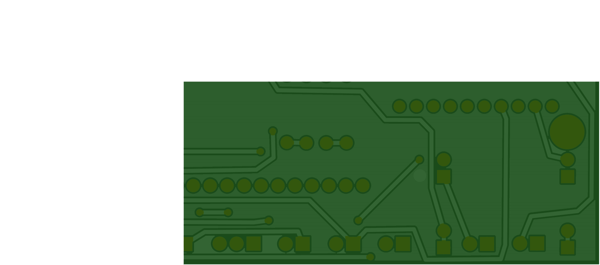
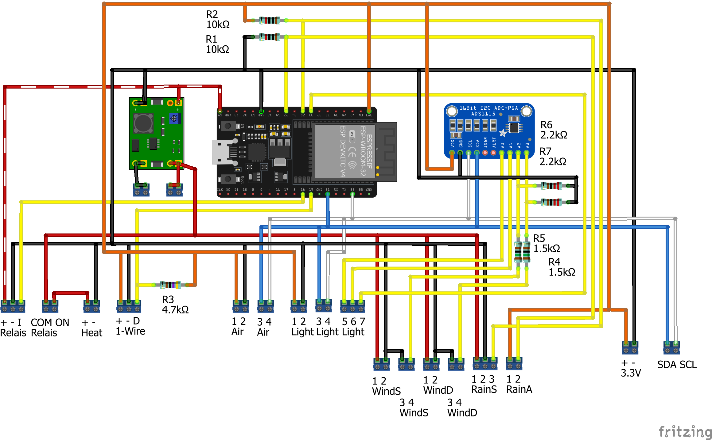

# WeatherLox
DIY Weatherstation for Smarthomes and amateur meteorologist and enthusiasts.

This PCB is for the ESP32 and the additional Analog-Digital converter ADS1115 and the DC-DC step down.

The breadboard looks like this:

